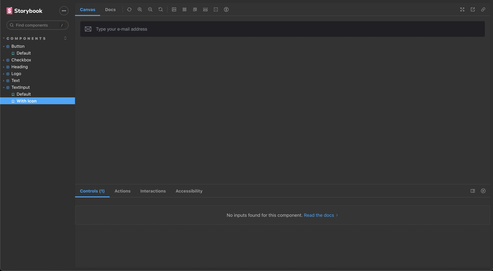
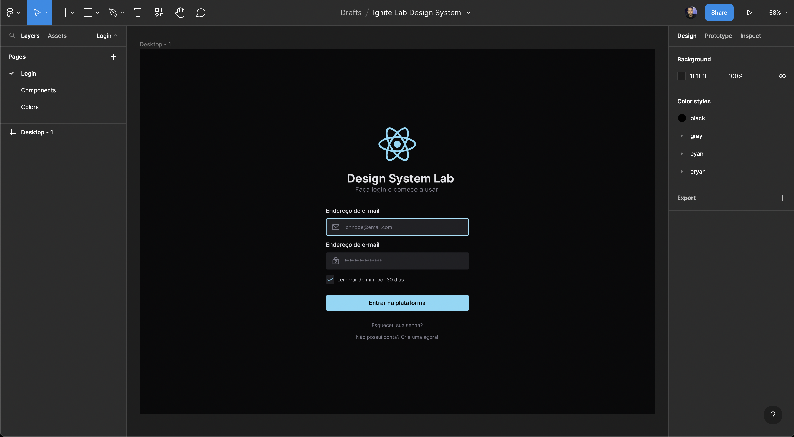
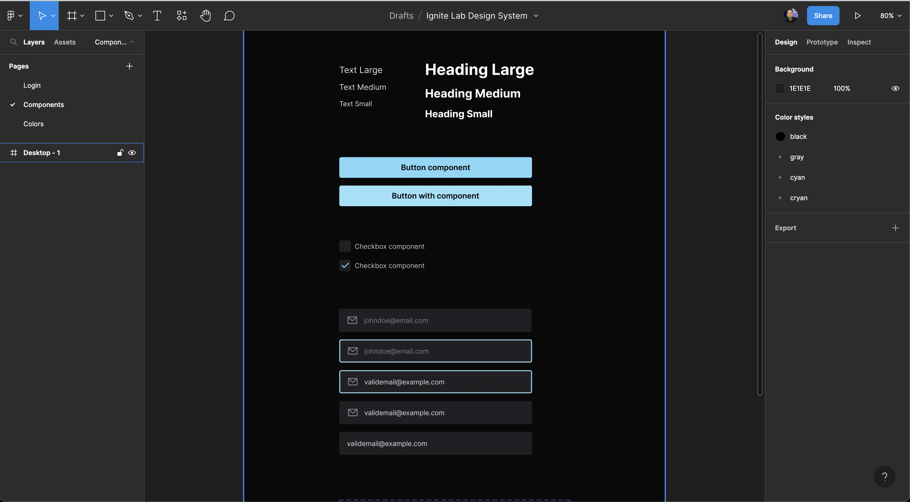
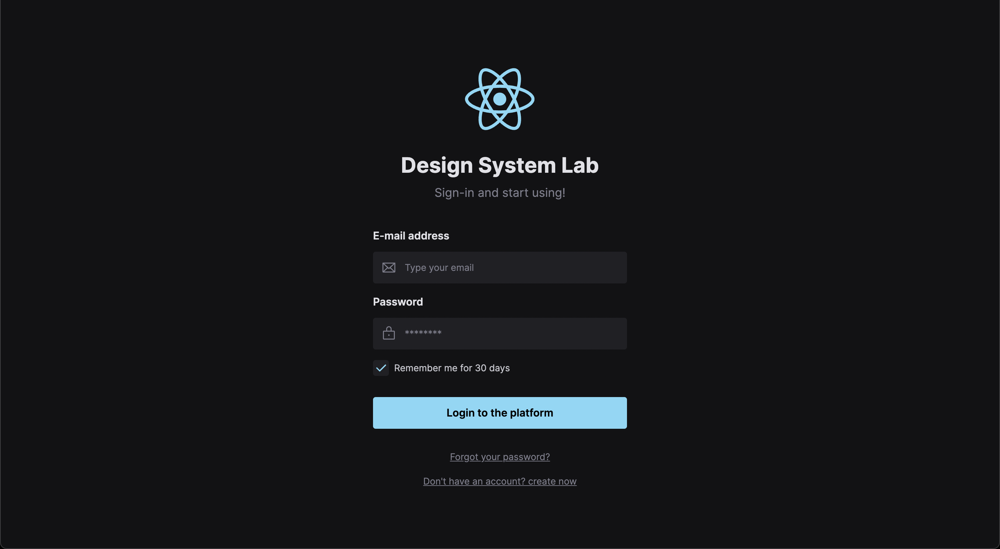

<div align="center" style="margin-bottom: 20px;">
  <h1>Design System with React.js</h1>
  <p align="center">
      
      
      
      
      
  </p>
  
</div>

### About project
A design system project, components to be reused in the construction of interfaces with the javascript library **React.js**, for the development of this design system tools such as figma, reactjs, storybook, tailwindcss and others were used.

### Run project
```bash
# Clone this repository
$ git clone https://github.com/jefferson1104/design-system-lab-reactjs.git

# Access the project folder
$ cd design-system-lab-reactjs

# Install dependencies
$ yarn install

# Run storybook
$ yarn storybook

# Run page example
$ yarn dev
```


### Notes
- [Figma project](https://www.figma.com/file/vIrOIaV598GdhrAOoFnbZE/Ignite-Lab-Design-System)
- [notes on library configurations and installations](NOTES.md)

### Screenshots
<p align="center">
  
  
  
  
</p>
